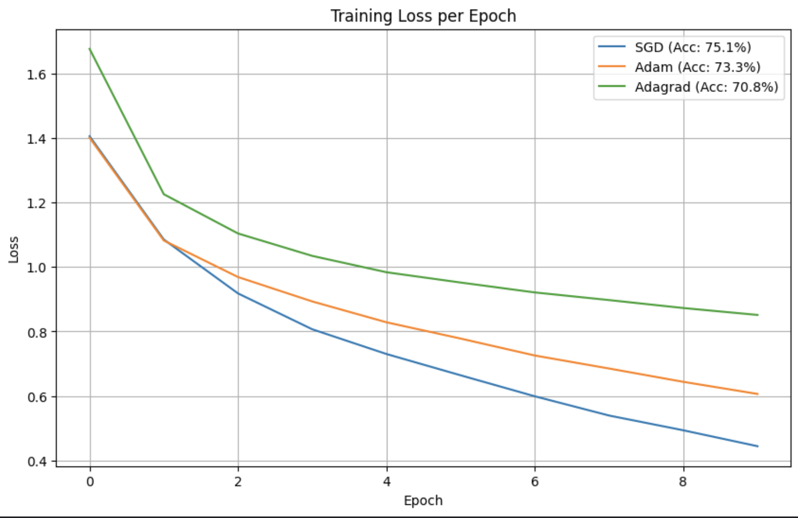
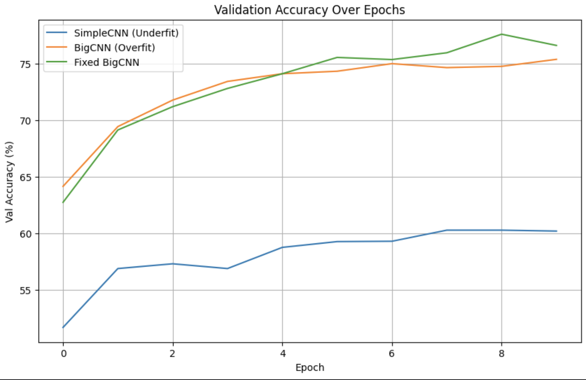
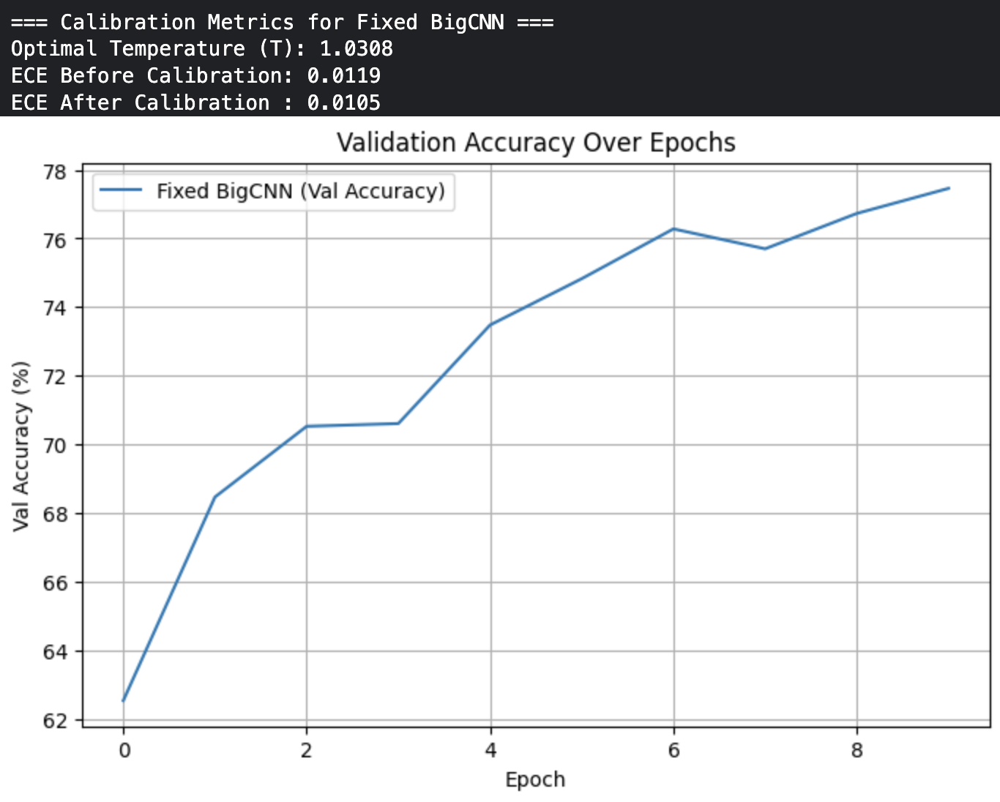

# 📊 Application of Neural Network on CIFAR-10 dataset

## Overview

This project demonstrates the design, training, evaluation, and calibration of convolutional neural networks (CNNs) on the CIFAR-10 dataset. The primary goals were:

- Achieve specific accuracy targets through architectural tuning
- Compare various optimization algorithms (SGD, Adam, Adagrad)
- Analyze and fix underfitting/overfitting
- Apply calibration techniques to improve model reliability

---

## 🧠 Model Architectures

### 1. **BaseCNN**
- **Structure:** 2 convolutional layers + 2 fully connected layers
- **Purpose:** Baseline model to establish initial performance

### 2. **TunedCNN**
- **Structure Enhancements:**
  - Increased filter sizes
  - Batch normalization
  - Dropout for regularization
- **Purpose:** Improved generalization and performance

### 3. **SimpleCNN** *(Underfitting Example)*
- Very shallow network
- Demonstrates limited capacity for capturing CIFAR-10 features

### 4. **BigCNN** *(Overfitting Example)*
- Deep network with high capacity
- Overfits without regularization
- Later fixed using **Dropout**, **Data Augmentation**, and **Weight Decay**

---

## 🧪 Training & Evaluation

### Dataset
- **CIFAR-10**: 60,000 images (10 classes)
- **Train/Test Split:** 50,000 / 10,000
- **Preprocessing:**
  - Normalization: `mean = 0.5`, `std = 0.5`
  - Optional data augmentation for regularization

### Training Settings
- **Loss Function:** CrossEntropyLoss
- **Epochs:** 10
- **Batch Size:** 64
- **Device:** CUDA (GPU)

---

## ⚙️ Optimization Algorithms

The project compares three optimizers using the **TunedCNN** model:

| Optimizer | Final Test Accuracy | Convergence Speed |
|----------|----------------------|-------------------|
| SGD      | **75.07%**           | Steady and effective |
| Adam     | **74.88%**           | Fast convergence, slightly less generalization |
| Adagrad  | **70.84%**           | Slower and less effective on this task |

### 📈 Training Loss Curves

The following plot compares the training losses across epochs for all three optimizers:

---

## ⚠️ Underfitting vs Overfitting

To understand model complexity effects:

- **SimpleCNN** (Underfitting): Low train and validation accuracy
- **BigCNN** (Overfitting): High train accuracy, validation plateaus
- **Fixed BigCNN**: Added dropout, L2 regularization, and augmentation → Balanced accuracy

### 📉 Validation Accuracy Curves

---

## ✅ Model Calibration

To improve trustworthiness of predictions, **temperature scaling** was applied:

- **Expected Calibration Error (ECE)** is computed before and after calibration.
- Calibration improves confidence alignment without affecting accuracy.

### Calibration Pipeline

1. Collect logits and true labels on validation set
2. Optimize temperature parameter `T` using LBFGS
3. Apply scaled logits `logits / T`
4. Recompute softmax and measure ECE

---

## 🔍 Results Summary

| Model        | Accuracy (%) | Notes                              |
|--------------|--------------|-------------------------------------|
| BaseCNN      | 69.96        | Simple, fast convergence            |
| TunedCNN     | 74.88        | Improved architecture               |
| TunedCNN + SGD | 75.07      | Best result with careful tuning     |
| SimpleCNN    | 60.22        | Underfitting issue                  |
| BigCNN       | 74.77        | Overfits without regularization     |
| Fixed BigCNN | **77.61**    | Best generalization after fixes     |

---

## 📁 Files and Figures

- Codebase includes modules for:
  - CNN architecture
  - Data loading and augmentation
  - Optimizer experimentation
  - Model calibration and ECE

---

## 📌 Key Takeaways

- Model tuning (BN, Dropout, wider filters) significantly improves accuracy.
- Optimizer choice impacts convergence behavior and generalization.
- Overfitting can be mitigated with dropout, augmentation, and L2 regularization.
- Model calibration using temperature scaling reduces overconfidence in predictions.
