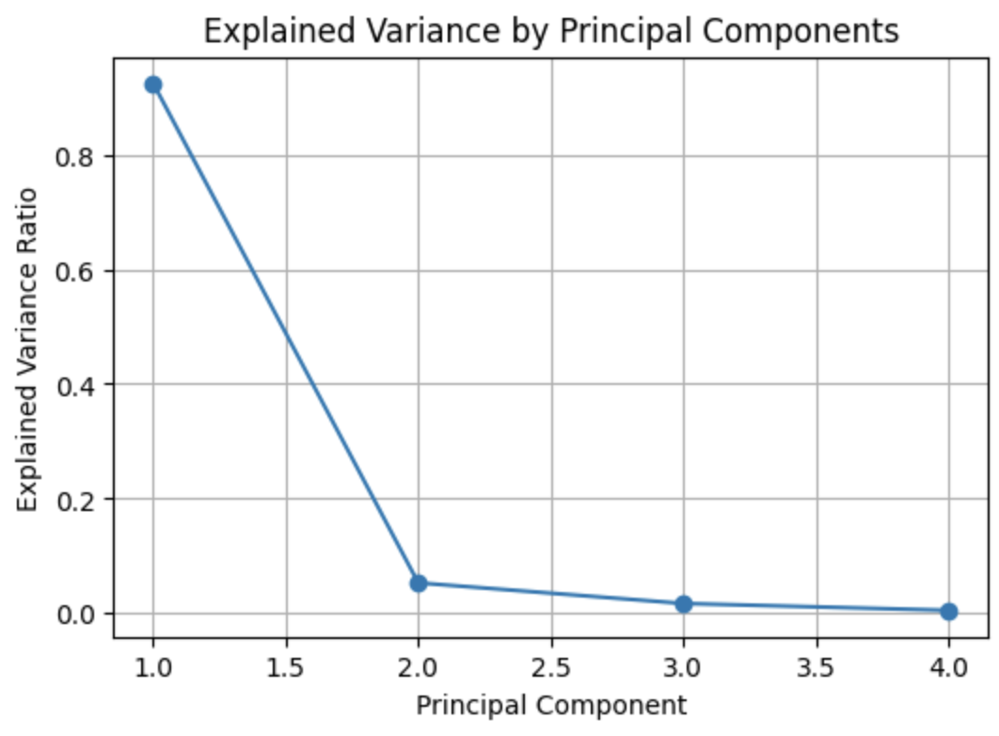
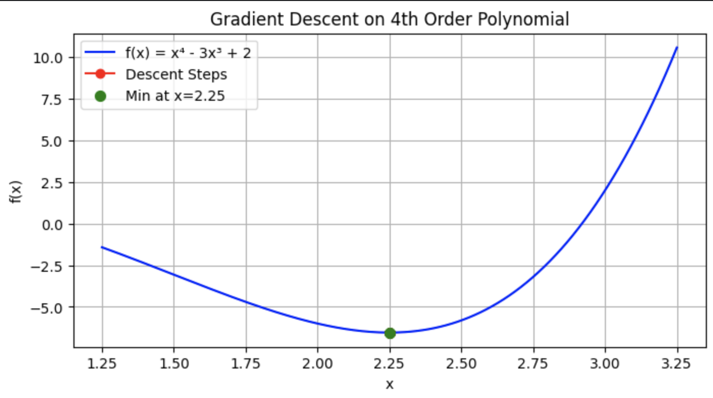
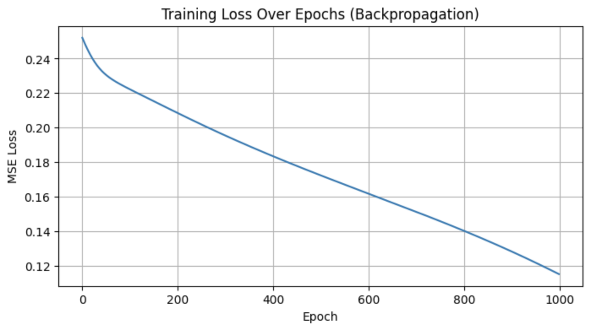

# 📊 Linear Algebra & Optimization Tasks — PCA, Gradient Descent & Backpropagation

This repository contains code and explanations for demonstrating foundational concepts in Machine Learning and Deep Learning — implemented **entirely from scratch** in **Kaggle Notebooks**. These implementations aim to showcase the application of **Linear Algebra**, **Numerical Optimization**, and **Neural Network Training Algorithms** without using high-level ML libraries like TensorFlow or PyTorch.

---

## ✅ Task 1: PCA from Scratch on Iris Dataset

### 📌 Objective
Demonstrate dimensionality reduction using **Principal Component Analysis (PCA)** from scratch — applying linear algebra operations directly.

### 🧠 Concept Recap
PCA identifies directions (principal components) in data that capture the maximum variance. It’s done through:
- Centering the data
- Computing the covariance matrix
- Eigen decomposition
- Projecting data onto the top eigenvectors

### 📂 Dataset
- **Source:** `Iris` dataset from `sklearn.datasets`
- **Features:** Sepal and petal length/width
- **Task:** Reduce to 2D and visualize

### 🛠️ Implementation Summary
- Centered the features
- Computed the covariance matrix
- Performed eigen decomposition
- Sorted and selected top 2 components
- Projected original data
- Visualized with color-coded labels
- Plotted explained variance ratio

### 📈 Outputs
- `results/pca_scratch.png`: Scatter plot of data in reduced 2D space
- `results/pca_variance.png`: Scree plot showing variance explained by each component

---

## ✅ Task 2: Gradient Descent on a 4th-Order Polynomial

### 📌 Objective
Use **gradient descent** to find the local minimum of a moderately complex function:
\[
f(x) = x^4 - 3x^3 + 2
\]

### 🧠 Concept Recap
Gradient Descent minimizes a function by iteratively moving in the direction of the negative gradient.

### 🛠️ Implementation Summary
- Defined the function and its gradient
- Initialized a value for `x`
- Applied gradient descent for 100 iterations
- Tracked value of `x` and `f(x)` over time
- Visualized both the descent steps and the true function curve

### 📈 Outputs

---

## ✅ Task 3: Backpropagation from Scratch

### 📌 Objective
Implement a small **2-layer neural network** (manually) and train it using **forward and backward passes** with gradient descent.

### 🧠 Concept Recap
- Neural networks learn by **backpropagating the loss gradients** through each layer.
- This involves applying the **chain rule** to calculate how weights should be updated.

### 🧪 Task Setup
- Inputs: `X = [[0,1], [1,0], [1,1]]`
- Labels: `y = [[1], [1], [0]]`
- Architecture: 2 ➝ 3 ➝ 1 fully connected neural net with sigmoid activations
- Loss function: Mean Squared Error (MSE)

### 🛠️ Implementation Summary
- Implemented forward pass using matrix multiplication and sigmoid activation
- Implemented backward pass using derivative of sigmoid and chain rule
- Updated weights using gradient descent
- Tracked loss every epoch

### 📈 Outputs

---

## 🔧 Environment & Requirements

- All code was executed in **Kaggle Notebooks**
- Libraries used: `numpy`, `matplotlib`, `sklearn.datasets`
- No deep learning frameworks (e.g., TensorFlow or PyTorch) were used

---

## 🧠 Learning Outcomes

| Concept | Skill Demonstrated |
|--------|---------------------|
| Linear Algebra | PCA from scratch (eigenvalues, projections) |
| Optimization | Gradient descent, function minimization |
| Deep Learning | Neural networks, forward/backward pass, MSE loss, sigmoid, gradient chain rule |

---

## ✍️ Author

Sudhin Karki

All tasks were completed and documented in **Kaggle Notebooks**. 

