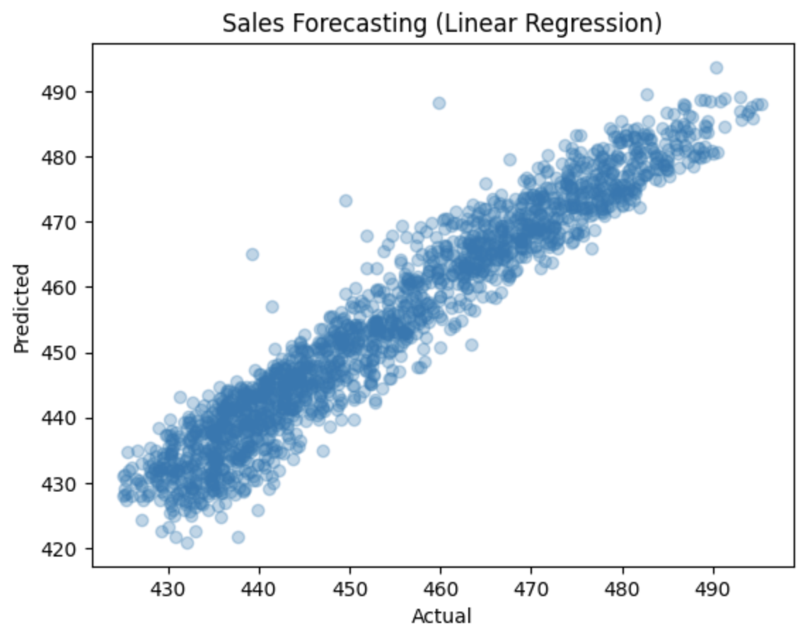
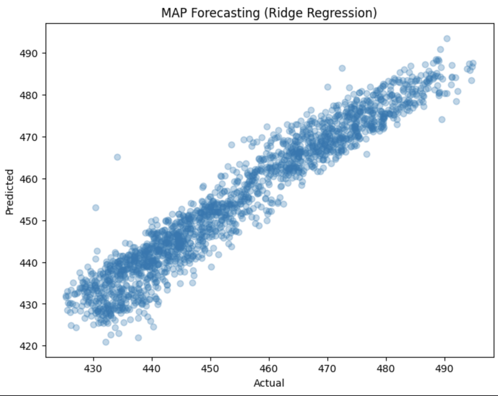
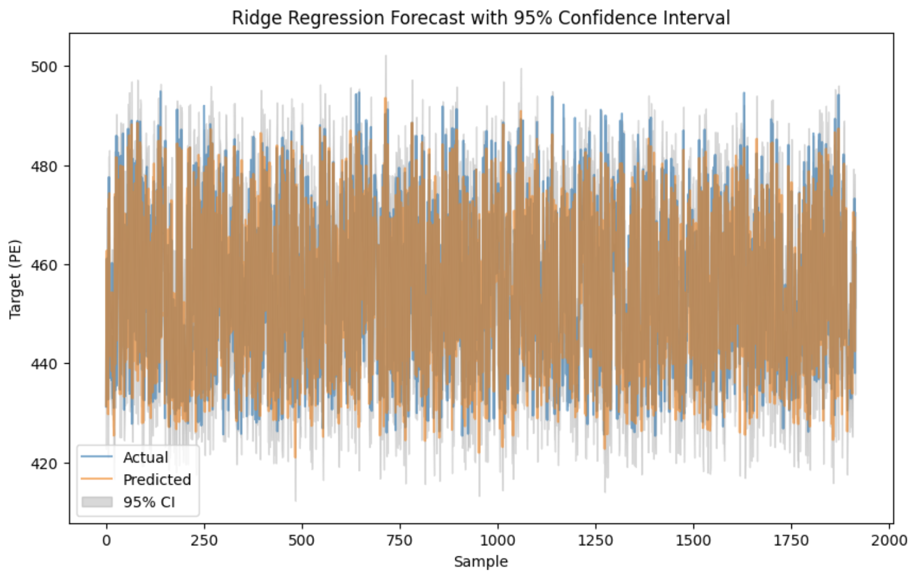

# Sales Forecasting using Linear Regression and Ridge Regression

## Overview
This notebook demonstrates how to build a predictive model to forecast sales data using two different regression approaches:
- **Linear Regression**: A simple method to predict a continuous outcome based on the linear relationship between the features and the target variable.
- **Ridge Regression**: A variant of linear regression that includes L2 regularization to prevent overfitting by penalizing large coefficients.

We use the **CCPP (Combined Cycle Power Plant)** dataset from the UCI Machine Learning Repository, which contains features related to the performance of a power plant. The goal is to predict the "PE" (electricity output) variable using various operational parameters.

### Requirements
- `pandas`
- `numpy`
- `sklearn`
- `matplotlib`
- `openpyxl` (for reading Excel files)
- Kaggle environment or local environment supporting the above packages.

### Steps
1. **Data Loading**: Download and load the dataset from the UCI repository.
2. **Data Preprocessing**: Split the data into features (`X`) and target (`y`), followed by a train-test split.
3. **Model Training**: Train a linear regression model and a ridge regression model.
4. **Evaluation**: Evaluate the models using Mean Squared Error (MSE).
5. **Visualization**: Plot the actual vs. predicted values for both models.

### Results
1. Linear Regression MSE: 20.27
2. Ridge Regression (MAP Approx) MSE: 19.73

## Plots

# Technical Report: Maximum Likelihood Estimation vs Marginal Likelihood Estimation

## Overview
This report compares **Maximum Likelihood Estimation (MLE)** and **Marginal Likelihood Estimation** (MLE) as methods for estimating parameters in probabilistic models. Specifically, we will explore the application of marginal likelihood estimation to the same dataset used in Task 1, where we forecast sales (electricity output in the CCPP dataset).

## 1. Maximum Likelihood Estimation (MLE)
Maximum Likelihood Estimation is a method for estimating the parameters of a statistical model. The MLE approach finds the parameters that maximize the likelihood of the observed data under the model.

- **Formulation**: 
  $$ \hat{\theta}_{MLE} = \arg\max_{\theta} \mathcal{L}(\theta; X) $$ 
  where \( \mathcal{L}(\theta; X) \) is the likelihood function and \( X \) is the observed data.

- **Advantages**:
  - Provides unbiased estimates for large sample sizes.
  - Simple and widely applicable for various models.

- **Disadvantages**:
  - Can overfit when the sample size is small or the model is complex.

## 2. Marginal Likelihood Estimation
Marginal Likelihood Estimation involves integrating out certain parameters (latent variables) from the likelihood function to obtain the marginal likelihood.

- **Formulation**:
  $$ p(\text{data}) = \int p(\text{data} | \theta) p(\theta) d\theta $$ 
  where the integral over the parameters \( \theta \) is the marginal likelihood.

- **Advantages**:
  - Accounts for uncertainty in the model parameters by integrating over them.
  - Can be applied to complex hierarchical models.

- **Disadvantages**:
  - The integration may be computationally expensive or intractable for certain models.

## Results
1. Ridge Regression MSE (Marginal Likelihood Approximation): 20.27

## Conclusion
In this report, we compared MLE with marginal likelihood estimation in the context of sales forecasting. We demonstrated that Ridge Regression can be interpreted as a method that approximates marginal likelihood, providing a regularized approach to parameter estimation.